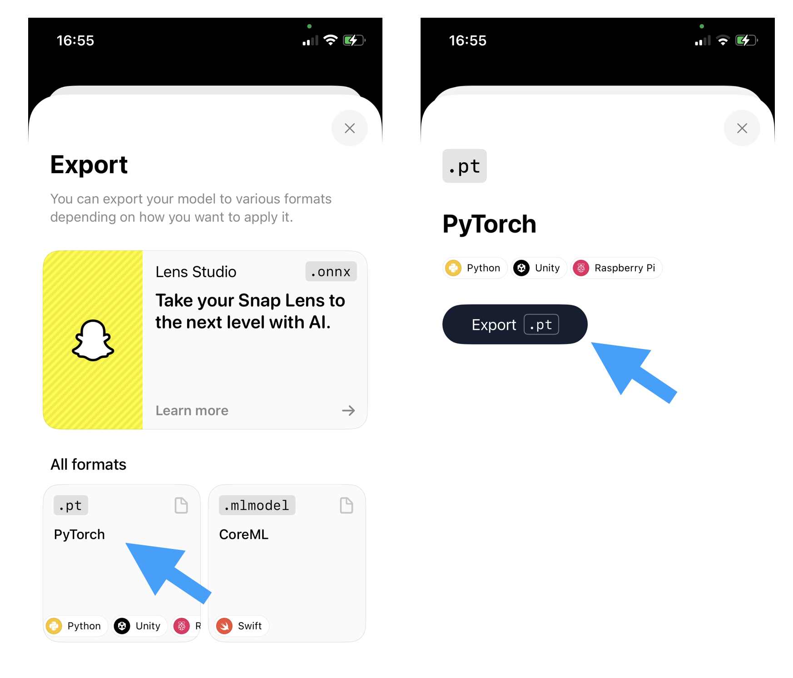

# Pytorch webcam example

This example shows how you can export a PyTorch model and its categories and run the model locally on your webcam with Python.

## How to run

1. A Python virtual environment is not necesseray but helps keeping things clean. You can make one like so:

   `$ python3 -m venv .venv`

   Make sure youre running a recent version of Python3. This code was tested with 3.9.

   You can then activate that environment by running:

   `$ source .venv/bin/activate`

2. Install the required dependencies:

   `$ pip install -r requirements.txt`

3. Export your model from the FieldDay App.

   This can be accesed via the share sheet in your project.

   

   After exporting you should have a model file with a `.pt` extention as well as a file called `labels.txt`.
   Put both of those files in this folder (i.e. next to `main.py`).

4. Now you have everything you need to run the script.

   You need to provide the name of the model file as the first argument like this:

   `$ python main.py "Your Model.pt"`

Hopefully you should see your webcam window and your terminal should show you the predicted category.

If you encounter any issues please reach out via a Github issue or on our Discord server: https://discord.gg/VrVmdwjj.
